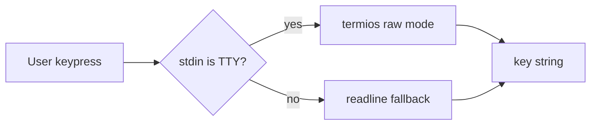

# scitex-etc

<p align="center">
  <a href="https://scitex.ai">
    
  </a>
</p>

<p align="center"><b>Interactive keyboard input utilities for the SciTeX ecosystem.</b></p>

<p align="center">
  <a href="https://scitex-etc.readthedocs.io/">Full Documentation</a> · <code>uv pip install scitex-etc[all]</code>
</p>

<!-- scitex-badges:start -->
<p align="center">
  <a href="https://pypi.org/project/scitex-etc/"></a>
  <a href="https://pypi.org/project/scitex-etc/"></a>
  <a href="https://github.com/ywatanabe1989/scitex-etc/actions/workflows/rtd-sphinx-build-on-ubuntu-latest.yml"></a>
</p>
<p align="center">
  <a href="https://github.com/ywatanabe1989/scitex-etc/actions/workflows/pytest-matrix-on-ubuntu-py3-11-3-12-3-13.yml"></a>
  <a href="https://github.com/ywatanabe1989/scitex-etc/actions/workflows/import-smoke-on-ubuntu-py3-12.yml"></a>
  <a href="https://codecov.io/gh/ywatanabe1989/scitex-etc"></a>
</p>
<!-- scitex-badges:end -->

---

## Problem and Solution

| # | Problem | Solution |
|---|---------|----------|
| 1 | **Scripts that pause for a keypress need raw-stdin + termios gymnastics** — 15 lines of OS-dependent boilerplate | **`wait_key()` / `count()`** — one import; handles Linux/macOS/Windows; falls back cleanly when stdin isn't a TTY |

## Installation

```bash
pip install scitex-etc
```

## Architecture

```
scitex-etc/
├── src/scitex_etc/
│   ├── _wait_key.py     # cross-platform raw-stdin keypress
│   └── _count.py        # countdown helper
└── tests/
```

## 1 Interfaces

<details open>
<summary><strong>Python API</strong></summary>

<br>

```python
import multiprocessing
from scitex_etc import wait_key, count

# Run the counter in a subprocess, wait for 'q' to stop it.
p = multiprocessing.Process(target=count)
p.start()
wait_key(p)  # Blocks until 'q' is pressed, then terminates the process
```

</details>

<details>
<summary><strong>Media handling (<code>scitex_etc.media.render</code>)</strong></summary>

<br>

```python
from scitex_etc.media import render

# Classify a file by its extension
render.classify("fig.png")          # {"type": "image", "path": "fig.png", "ext": ".png"}

# Detect media refs in tool output
render.detect("Saved /proj/fig.png", root_path="/proj")
# [{"type": "image", "path": "fig.png", "ext": ".png"}]

# Render to a target: terminal (OSC overlay), chat, or markdown
render.show("fig.png", target="markdown")  # ""
```

Also available as a CLI (`python -m scitex_etc.media.render show|classify|detect`)
and as MCP tools (`scitex_etc.media.render.mcp_server`).

</details>

## Demo



## Quick Start

```python
import multiprocessing
from scitex_etc import wait_key, count

# count() prints an incrementing counter forever (1 per second).
# Run it in a subprocess and use wait_key() to stop on 'q'.
p = multiprocessing.Process(target=count)
p.start()
wait_key(p)
```

## Part of SciTeX

`scitex-etc` is part of [**SciTeX**](https://scitex.ai). Install via
the umbrella with `pip install scitex[etc]` to use as
`scitex.etc` (Python) or `scitex etc ...` (CLI).

>Four Freedoms for Research
>
>0. The freedom to **run** your research anywhere — your machine, your terms.
>1. The freedom to **study** how every step works — from raw data to final manuscript.
>2. The freedom to **redistribute** your workflows, not just your papers.
>3. The freedom to **modify** any module and share improvements with the community.
>
>AGPL-3.0 — because we believe research infrastructure deserves the same freedoms as the software it runs on.

## License

AGPL-3.0

---

<p align="center">
  <a href="https://scitex.ai" target="_blank"></a>
</p>
